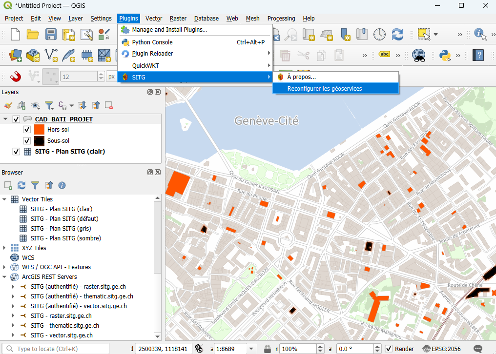

# Plugin QGIS SITG 

Ce plugin permet de faciliter l'utilisation des services du Système d'Informations du Territoire du Canton de Genève ([SITG](https://sitg.ge.ch/)) dans [QGIS](https://qgis.org/).



Fonctionalités:

- pré-configuration des fonds de cartes officiels SITG en **tuiles vectorielles**
- pré-configuration des géoservices **vector.sitg.ge.ch**, **raster.sitg.ge.ch** et **thematic.sitg.ge.ch**
- support de l'**accès authentifié** via compte GINA/e-Demarches aux géoservices
- raccourci vers le **catalogue de données** du SITG

> [!IMPORTANT]
> L'utilisation des données du SITG est soumise à [conditions](https://sitg.ge.ch/ressources/conditions-utilisation-donnees). Le niveau d'accès de chaque données est décrit dans le [catalogue web](https://sitg.ge.ch).

> [!CAUTION]
> Les services du SITG sont basés sur des solutions propriétaires qui ne sont encore que partiellement compatibles avec QGIS et l'écosystème géomatique libre.
>
> Divers problèmes de performance ou de fiabilité sont connus et l'utilisation de QGIS comme client pour consommer les geoservices du SITG doit être considérée comme expérimentale. L´État de Genève contribue activement à l'amélioration de la compatibilité de QGIS et tient ses utilisateurs informés via sa [newsletter](https://sitg.ge.ch/contact#newsletter).
>
> Pour les travaux critiques, nous vous recommandons de vous orienter davantage vers les données en téléchargement disponibles depuis le [catalogue web](https://sitg.ge.ch).

## Installation

Le plugin est disponible directement depuis le gestionnaire d'extensions de QGIS sous le nom `SITG`. Pour le moment, il est nécessaire de cocher la case `activer les extensions expérimentales` dans l'onglet paramètres du gestionnaire d'extensions pour qu'il apparaisse dans la liste.

Si l'installation a fonctionné, un nouveau sous-menu `SITG` devraît être apparu dans le menu `Extensions`.

## Contact / aide

Si vous rencontrez un problème ou que vous avez une suggestion pour le présent plugin, n'hésitez pas à ouvrir une issue github pour signaler un problème.

Pour les questions générales relatives au SITG (données, services, etc.) référez-vous à la page contact: https://sitg.ge.ch/contact

## Contribuer

Les contributions au plugin sont bienvenues sous forme de pull request. Avant de vous lancer dans un développement complexe, prenez contact avec nous en créant une issue afin de discuter de l'idée, pour s'assurer que la contribution puisse être intégrée au plugin officiel.

### Environnement de développement

<details>
<summary>Voir les recommandations pour configurer un environnement de développement  (applicable à tout plugin QGIS)</summary>

Voici les étapes pour configurer un environnement de développement pour ce plugin permettant l'autocomplétion dans l'IDE, le formattage automatique du code ainsi que le rechargement dynamique du plugin sans redémarrer QGIS

Pré-requis: [UV](https://docs.astral.sh/uv/getting-started/installation/) et QGIS.

```sh
# créer un environnement virtuel préconfiguré pour QGIS grâce à https://github.com/GispoCoding/qgis-venv-creator
uvx --from qgis-venv-creator create-qgis-venv.exe --venv-name .venv

# installer l'outillage de développement
uv pip install -r requirements-dev.txt

# installer l'auto-formatteur
uv run pre-commit install
```

Puis dans VSCode, s'assurer d'activer l'environnement `.env` avec la commande `Python: Select interpreter`.

Pour recharger le code dynamiquement grâce au plugin `Plugin reloader`, il faut créer un lien symbolique depuis votre dossier de plugins QGIS vers le dossier `qsitg` du code.

```sh
# à lancer dans l'invite de commande en mode administrateur
mklink /D %appdata%\QGIS\QGIS3\profiles\default\python\plugins\qsitg C:\chemin\vers\dossiergit\qsitg
```

</details>

### Packager

Pour déclencher le packaging et la release d'une nouvelle version, créer une release dans github. Le nom de la release doit suivre les conventions de version sémantique. Les pre-releases (p. ex. `1.2.3-alpha1`) seront automatiquement packagées comme expérimentales.
