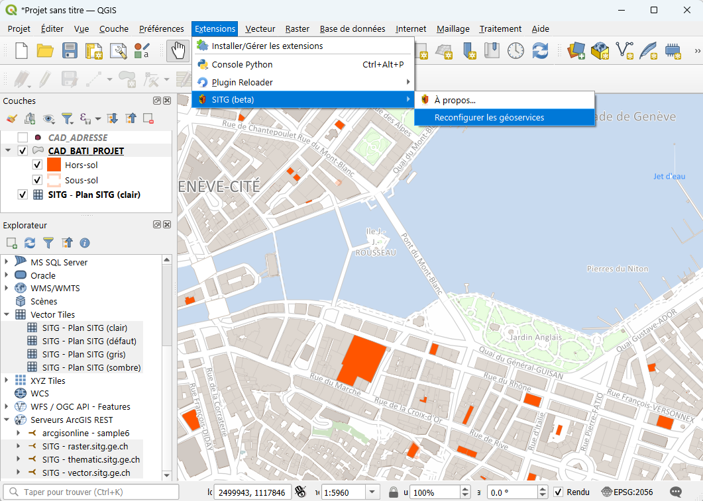

# Plugin QGIS SITG

Plugin QGIS permettant de distribuer des resources pour le SITG.



Pour le moment, le plugin permet la configuration pour les endpoints vector.sitg.ge.ch, raster.sitg.ge.ch, thematique.sitg.ge.ch, à chaque fois avec ou sans authentification OAuth2, ainsi que les tuiles vectorielles.

## Installer

En attendant sa mise à disposition via le dépôt d'extension officiel de QGIS, le plus est installable via un dépôt temporaire dédié.

1. Dans le gestionnaire d'extensions, onglet paramètre, ajouter le dépot `https://github.com/republique-et-canton-de-geneve/qgis_plugin_sitg/releases/latest/download/plugins.xml`
2. Rechercher le plugin `qsitg` et l'installer

Si l'installation a fonctionné, un nouveau sous-menu devraît être apparu dans le menu `Extensions`.

## Contact / aide

Si vous rencontrez un problème ou que vous avez une suggestion pour le présent plugin, n'hésitez pas à ouvrir une issue github pour signaler un problème.

Pour les questions générales relatives au SITG (données, services, etc.) référez-vous à la page contact: https://sitg.ge.ch/contact

## Contribuer

Les contributions au plugin sont bienvenues sous forme de pull request. Avant de vous lancer dans un développement complexe, prenez contact avec nous en créant une issue afin de discuter de l'idée, pour s'assurer que la contribution puisse être intégrée au plugin officiel.

### Environnement de développement

<details>
<summary>Voir les recommandations pour configurer un environnement de développement  (applicable à tout plugin QGIS)</summary>

Voici les étapes pour configurer un environnement de développement pour ce plugin permettant l'autocomplétion dans l'IDE, le formattage automatique du code ainsi que le rechargement dynamique du plugin sans redémarrer QGIS

Pré-requis: [UV](https://docs.astral.sh/uv/getting-started/installation/) et QGIS.

```sh
# créer un environnement virtuel préconfiguré pour QGIS grâce à https://github.com/GispoCoding/qgis-venv-creator
uvx --from qgis-venv-creator create-qgis-venv.exe --venv-name .venv

# installer l'outillage de développement
uv pip install -r requirements-dev.txt

# installer l'auto-formatteur
uv run pre-commit install
```

Puis dans VSCode, s'assurer d'activer l'environnement `.env` avec la commande `Python: Select interpreter`.

Pour recharger le code dynamiquement grâce au plugin `Plugin reloader`, il faut créer un lien symbolique depuis votre dossier de plugins QGIS vers le dossier `qsitg` du code.

```sh
# à lancer dans l'invite de commande en mode administrateur
mklink /D %appdata%\QGIS\QGIS3\profiles\default\python\plugins\qsitg C:\chemin\vers\dossiergit\qsitg
```

</details>

### Packager

Pour déclencher le packaging et la release d'une nouvelle version, créer une release dans github. Le nom de la release doit suivre les conventions de version sémantique. Les pre-releases (p. ex. `1.2.3-alpha1`) seront automatiquement packagées comme expérimentales.
